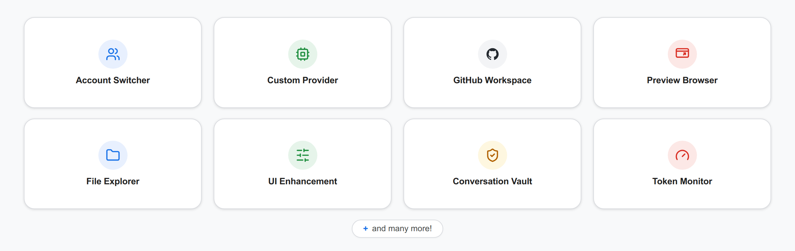

<p align="center">
  
</p>

<h1 align="center">Antigravity Swiss Knife</h1>

Cross-platform companion for Google Antigravity

[Features](#key-features)  • [Quick Start](#quick-start)  •  [GUI](#gui-examples)  •  [FAQ](#frequently-asked-questions)  •  [Wiki](#documentation-wiki)  •  [License](#license)

---

Antigravity Swiss Knife is a cross-platform local desktop companion and background daemon for Antigravity, which does NOT violet Google's Terms of Services.

It supports Antigravity 2.0,  CLI,  Code Extension across Linux, Windows* and macOS*.

...early stage...please raise issues...discuession...

## Key Features



## Quick Start

### Installation

**Download ready-to-run installers from [Releases](https://github.com/ChillingWombat/AntigravitySwissKnife/releases)**

<table class="markdown-table">
  <tr><th>Platform</th><th>Package Format</th><th>Install Location</th></tr>
  <tr><td>Linux</td><td>.deb package</td><td>/opt/antigravity-swiss-knife</td></tr>
  <tr><td>Windows</td><td>NSIS installer (.exe)</td><td>%LOCALAPPDATA%\Programs\Antigravity Swiss Knife</td></tr>
  <tr><td>macOS</td><td>Disk Image (.dmg)</td><td>/Applications/Antigravity Swiss Knife.app</td></tr>
</table>

### Linux Dedicated Out-of-Tree Installer

To install directly from source into your user directory (`~/.local/share/antigravity-swiss-knife`):

```bash
npm run install:linux
```

This bundles the companion daemon, installs desktop icons, and configures the desktop menu entry.

### Building from Source

```bash
git clone https://github.com/ChillingWombat/AntigravitySwissKnife.git
cd AntigravitySwissKnife
npm install
npm run build
npm run desktop
```

To run only the headless companion daemon:

```bash
./bin/swiss daemon --web --addr 127.0.0.1:8765
```

## GUI Examples

**Antigravity Swiss Knife**

**Antirgravity 2.0**

## Frequently Asked Questions

1. **What platforms does it support?**  
It is designed to be cross-platform. However, due to personal limited time, this project was developed on Linux and done much more testing there than Windows and  macOS.
2. **Does it supports API Proxy server?**  
No, ...  violate ToS. ....each account
3. **Will I get banned for using Account Switcher?**  
No, ...(reference to ToS and  google emplyee's quoate)...
4. **Does it allow having seperate Google accounts for subagents?**  
No,...violate ToS..... it only custom models as subagents...
5. **Are my credentials safe?**  
Yes,............local only, can be password encrypted......
6.

## Documentation Wiki

Comprehensive architecture specs, multi-app fleet guides, and developer workflows are documented in the [GitHub Wiki](https://github.com/ChillingWombat/AntigravitySwissKnife/wiki):

- [Architecture & Multi-Process Daemon](https://github.com/ChillingWombat/AntigravitySwissKnife/wiki/Architecture-and-Multi-Process-Daemon): Inter-process communication, SQLite WAL protection, and CDP runtime injection.
- [Multi-App Fleet Sync & Account Switching](https://github.com/ChillingWombat/AntigravitySwissKnife/wiki/Multi-App-Fleet-Sync-and-Account-Switching): Fleet modes, standby quota rotation, OS keyrings, and hardware fingerprint virtualization.
- [Active Conversation Continuation & Subagent Revival](https://github.com/ChillingWombat/AntigravitySwissKnife/wiki/Active-Conversation-Continuation-and-Subagent-Revival): Session detection, intent store, layout pinning, and automated CDP continuation.
- [ACP Agent Mesh Expansion](https://github.com/ChillingWombat/AntigravitySwissKnife/wiki/ACP-Agent-Mesh-Expansion): Registered agent nodes, GUI vs CLI node architecture, and handshake protocol.
- [Packaging, VM Validation & Installation](https://github.com/ChillingWombat/AntigravitySwissKnife/wiki/Packaging,-VM-Validation-and-Installation): Cross-platform release builds, Quickemu VM testing (Windows 11 & macOS), and Git worktrees.
- [Security, Compliance & Cache Management](https://github.com/ChillingWombat/AntigravitySwissKnife/wiki/Security,-Compliance-and-Cache-Management): Google Terms of Service alignment, zero-proxy architecture, and cache pruning.

## License

This project is licensed under the [MIT License](LICENSE).

Antigravity Swiss Knife is an independent community project. It is not affiliated with, sponsored by, or endorsed by Google LLC.
