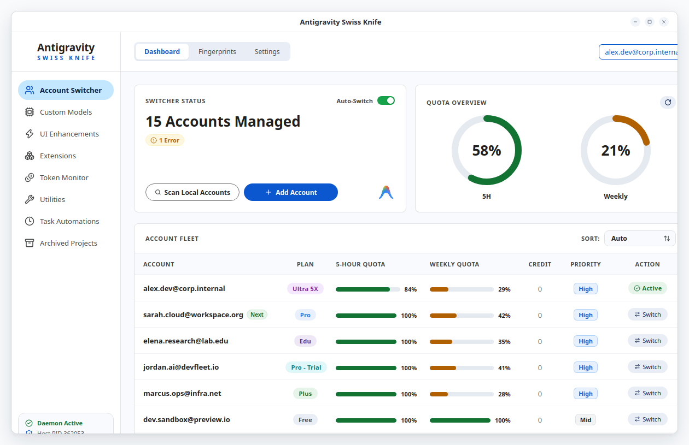

<p align="center">
  
</p>

<h1 align="center">Antigravity Swiss Knife</h1>

Cross-platform desktop companion and background daemon for Google Antigravity.

[Features](#key-features)  • [Quick Start](#quick-start)  •  [GUI](#gui-examples)  •  [FAQ](#frequently-asked-questions)  •  [Wiki](#documentation-wiki)  •  [License](#license)

---

Antigravity Swiss Knife is a cross-platform desktop companion and background daemon for Google Antigravity 2.0, the `agy` command-line utility, and the Antigravity VS Code Extension across Linux, Windows, and macOS. It operates 100% locally with zero network proxying to adhere strictly to Google Cloud Terms of Service.

As a new open-source project in active development, community feedback is warmly encouraged. Please feel free to raise issues, report bugs, or suggest feature ideas in our GitHub repository to help shape upcoming releases.

## Key Features


## Quick Start

### Installation

Download ready-to-run installers from [Releases](https://github.com/ChillingWombat/AntigravitySwissKnife/releases):

<table class="markdown-table">
  <tr><th>Platform</th><th>Package Format</th><th>Install Location</th></tr>
  <tr><td>Linux</td><td>.deb package</td><td>/opt/antigravity-swiss-knife</td></tr>
  <tr><td>Windows</td><td>NSIS installer (.exe)</td><td>%LOCALAPPDATA%\Programs\Antigravity Swiss Knife</td></tr>
  <tr><td>macOS</td><td>Disk Image (.dmg)</td><td>/Applications/Antigravity Swiss Knife.app</td></tr>
</table>

### Linux Dedicated Out-of-Tree Installer

To install directly from source into your user directory (`~/.local/share/antigravity-swiss-knife`):

```bash
npm run install:linux
```

This bundles the companion daemon, installs desktop icons, and configures the desktop menu entry.

### Building from Source

```bash
git clone https://github.com/ChillingWombat/AntigravitySwissKnife.git
cd AntigravitySwissKnife
npm install
npm run build
npm run desktop
```

To run only the headless companion daemon:

```bash
./bin/swiss daemon --web --addr 127.0.0.1:8765
```

## GUI Examples



## Frequently Asked Questions

1. **What platforms does Antigravity Swiss Knife support?**  
It runs on 64-bit Linux (`.deb` and source installer), Windows 10/11 (NSIS installer), and macOS (Apple Silicon and Intel `.dmg`). Linux serves as the primary development platform with full desktop and CLI coverage. Windows and macOS packages are validated inside Quickemu virtualized environments.

2. **Does it use an API proxy server?**  
No. Antigravity Swiss Knife never deploys an HTTP MITM proxy or external network tunnel. Intercepting API traffic between your IDE and Google endpoints risks credential exposure and violates Google Cloud Terms of Service. Swiss Knife operates purely through direct local OS keyrings, SQLite WAL coordination, and native Chrome DevTools Protocol hooks on your machine.

3. **Will my accounts get banned for using the Account Switcher?**  
No. Account rotation updates OAuth refresh tokens inside your operating system's native keyring (Secret Service, Windows Credential Manager, macOS Keychain) exactly as official login sessions do. It does not generate synthetic API floods. It also virtualizes hardware identifiers (`machineid`, installation UUIDs) per account to prevent identity collision and telemetry linkage.

4. **Can I use separate Google accounts for subagents?**  
No. Spawning subagents across different Google accounts concurrently causes session race conditions and violates Terms of Service. Swiss Knife limits Google account switching strictly to the primary orchestrator session. Subagent offloading is designed exclusively for Custom Models (BYOK API keys for Anthropic, OpenAI, DeepSeek, or local Ollama instances), keeping Google account usage isolated and compliant.

5. **How are my credentials stored and secured?**  
All sensitive credentials—OAuth refresh tokens, passwords, and MFA secret seeds—remain strictly on your local machine. They are encrypted at rest with AES-256-GCM before writing to disk, or stored directly within your operating system's native keyring. You can also configure an optional application access master password (PBKDF2-HMAC-SHA256) to gate desktop entry behind an unlock screen.

6. **How does active session continuation work across account switches?**  
The `pkg/revival` subsystem detects your active conversation UUID (`cascadeId`) and subagent execution state before rotation occurs. It pins workspace layouts in `app_storage.json`, relaunches the host process, and re-injects prompt continuation commands over the Chrome DevTools Protocol so you can resume work without losing context.

## Documentation Wiki

Comprehensive architecture specs, multi-app fleet guides, and developer workflows are documented in the [GitHub Wiki](https://github.com/ChillingWombat/AntigravitySwissKnife/wiki):

- [Features Index](https://github.com/ChillingWombat/AntigravitySwissKnife/wiki/Features): Dedicated guides for all 12 navigation sections.
- [Architecture & Multi-Process Daemon](https://github.com/ChillingWombat/AntigravitySwissKnife/wiki/Architecture-and-Multi-Process-Daemon): Inter-process communication, SQLite WAL protection, and CDP runtime injection.
- [Multi-App Fleet Sync & Account Switching](https://github.com/ChillingWombat/AntigravitySwissKnife/wiki/Multi-App-Fleet-Sync-and-Account-Switching): Fleet modes, standby quota rotation, OS keyrings, and hardware fingerprint virtualization.
- [Active Conversation Continuation & Subagent Revival](https://github.com/ChillingWombat/AntigravitySwissKnife/wiki/Active-Conversation-Continuation-and-Subagent-Revival): Session detection, intent store, layout pinning, and automated CDP continuation.
- [ACP Agent Mesh Expansion](https://github.com/ChillingWombat/AntigravitySwissKnife/wiki/ACP-Agent-Mesh-Expansion): Registered agent nodes, GUI vs CLI node architecture, and handshake protocol.
- [Packaging, VM Validation & Installation](https://github.com/ChillingWombat/AntigravitySwissKnife/wiki/Packaging,-VM-Validation-and-Installation): Cross-platform release builds, Quickemu VM testing (Windows 11 & macOS), and Git worktrees.
- [Security, Compliance & Cache Management](https://github.com/ChillingWombat/AntigravitySwissKnife/wiki/Security,-Compliance-and-Cache-Management): Google Terms of Service alignment, zero-proxy architecture, and cache pruning.
- [Project Roadmap](https://github.com/ChillingWombat/AntigravitySwissKnife/wiki/Roadmap): Milestone history and planned fine-grained token breakdown (skills vs harness overhead).
- [Credits & Acknowledgements](https://github.com/ChillingWombat/AntigravitySwissKnife/wiki/Credits): Open-source libraries, protocol standards, and tools.

## License

This project is licensed under the [MIT License](LICENSE).

Antigravity Swiss Knife is an independent community project. It is not affiliated with, sponsored by, or endorsed by Google LLC.
