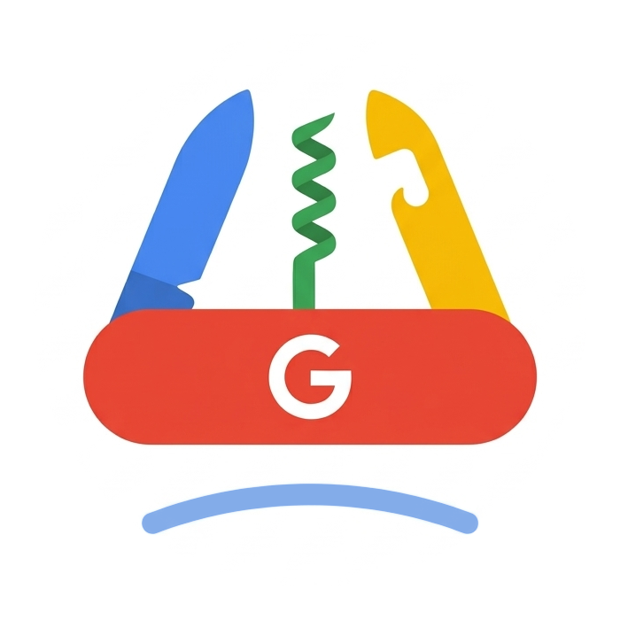

<p align="center">
  
</p>

<h1 align="center">Antigravity Swiss Knife</h1>

<p align="center">
  Open-source companion for Google Antigravity
</p>

<p align="center">
  <a href="#quick-start">Quick Start</a> •
  <a href="#key-capabilities">Capabilities</a> •
  <a href="#installation">Installation</a> •
  <a href="#architecture">Architecture</a> •
  <a href="#documentation-wiki">Documentation Wiki</a> •
  <a href="#license">License</a>
</p>

---

Antigravity Swiss Knife is a local desktop companion and background daemon for Google Antigravity 2.0. It coordinates multi-account quotas across installed Antigravity applications, continues active conversations and subagents across account switches, auto-prunes local caches, and monitors local agent runtimes with zero external proxies.

All credentials stay in your operating system's native secret storage (Linux Secret Service, macOS Keychain, Windows Credential Manager). All daemon communications run strictly over local loopback sockets.

---

## Key Capabilities

- **Multi-App Fleet Sync**: Track and switch Google CloudCode accounts across Antigravity Desktop, CLI (`agy`), and Extension. Supports shared-account fleet mode or independent accounts per app with automated standby rotation on quota exhaustion.
- **Conversation & Subagent Continuation**: Automatically captures active conversation context and running subagent tasks before account switches or app restarts, resuming them via Chrome DevTools Protocol (CDP) without requiring a manual user prompt.
- **Cache Auto-Pruning**: Inspects and safely reclaims disk space across conversation databases, step outputs, and tool logs with configurable time and size thresholds (defaulting to unlimited).
- **ACP Agent Mesh**: Discovers, monitors, and exchanges capabilities with 9 local Agent Client Protocol (ACP) nodes, including Antigravity 2.0, Antigravity CLI, Devin, OpenCode, DeepSeek Harness, Pi, Codex, Claude Code, and Cursor.
- **Native Keyring Security & Tray**: Operates directly with host OS keyrings. Provides a lightweight system tray menu with real-time quota indicators and one-click account switching.

---

## Installation

Download ready-to-run installers from [Releases](https://github.com/ChillingWombat/AntigravitySwissKnife/releases):

| Platform | Package Format | Install Location |
| :--- | :--- | :--- |
| **Linux** | `.deb` package | `/opt/antigravity-swiss-knife` |
| **Windows** | NSIS installer (`.exe`) | `%LOCALAPPDATA%\Programs\Antigravity Swiss Knife` |
| **macOS** | Disk Image (`.dmg`) | `/Applications/Antigravity Swiss Knife.app` |

### Linux Dedicated Out-of-Tree Installer
To install directly from source into your user directory (`~/.local/share/antigravity-swiss-knife`):
```bash
npm run install:linux
```
This bundles the companion daemon, installs desktop icons, and configures the desktop menu entry.

---

## Quick Start

### Building from Source

```bash
git clone https://github.com/ChillingWombat/AntigravitySwissKnife.git
cd AntigravitySwissKnife
npm install
npm run build
npm run desktop
```

To run only the headless companion daemon:
```bash
./bin/swiss daemon --web --addr 127.0.0.1:8765
```

---

## Architecture

The system operates across three local tiers: an injected client runtime inside Antigravity 2.0, a React 19 supervisory desktop interface, and a headless pure-Go companion daemon (`bin/swiss daemon`) communicating over Unix domain sockets and loopback HTTP.

```
+------------------------------------------------------------------------+
|                     Host Runtime (Antigravity 2.0)                     |
+------------------------------------------------------------------------+
                               | (CDP / DOM Injection)
+------------------------------------------------------------------------+
|             Supervisory Desktop Interface (Electron & React 19)        |
+------------------------------------------------------------------------+
                               | (Unix Domain Socket / Loopback HTTP)
+------------------------------------------------------------------------+
|               Companion Daemon Binary (bin/swiss daemon)               |
+------------------------------------------------------------------------+
                               |
                               v
            Operating System Keyring & SQLite Storage
```

---

## Documentation Wiki

Comprehensive architecture specs, multi-app fleet guides, and developer workflows are documented in the [GitHub Wiki](https://github.com/ChillingWombat/AntigravitySwissKnife/wiki):

- [Architecture & Multi-Process Daemon](https://github.com/ChillingWombat/AntigravitySwissKnife/wiki/Architecture-and-Multi-Process-Daemon): Inter-process communication, SQLite WAL protection, and CDP runtime injection.
- [Multi-App Fleet Sync & Account Switching](https://github.com/ChillingWombat/AntigravitySwissKnife/wiki/Multi-App-Fleet-Sync-and-Account-Switching): Fleet modes, standby quota rotation, OS keyrings, and hardware fingerprint virtualization.
- [Active Conversation Continuation & Subagent Revival](https://github.com/ChillingWombat/AntigravitySwissKnife/wiki/Active-Conversation-Continuation-and-Subagent-Revival): Session detection, intent store, layout pinning, and automated CDP continuation.
- [ACP Agent Mesh Expansion](https://github.com/ChillingWombat/AntigravitySwissKnife/wiki/ACP-Agent-Mesh-Expansion): Registered agent nodes, GUI vs CLI node architecture, and handshake protocol.
- [Packaging, VM Validation & Installation](https://github.com/ChillingWombat/AntigravitySwissKnife/wiki/Packaging,-VM-Validation-and-Installation): Cross-platform release builds, Quickemu VM testing (Windows 11 & macOS), and Git worktrees.
- [Security, Compliance & Cache Management](https://github.com/ChillingWombat/AntigravitySwissKnife/wiki/Security,-Compliance-and-Cache-Management): Google Terms of Service alignment, zero-proxy architecture, and cache pruning.

---

## License

This project is licensed under the [MIT License](LICENSE).

Antigravity Swiss Knife is an independent community project. It is not affiliated with, sponsored by, or endorsed by Google LLC.
