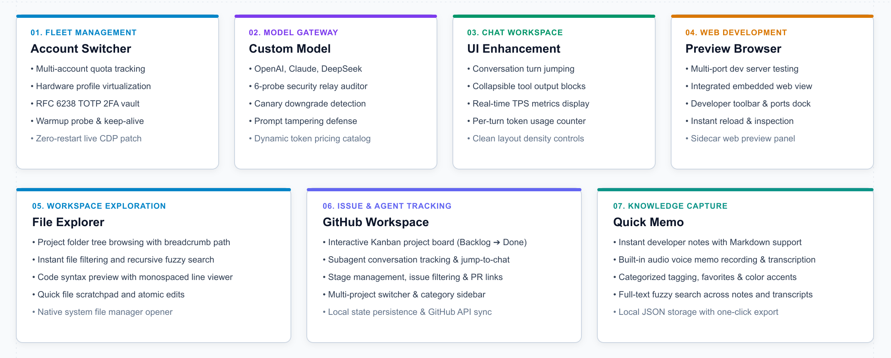
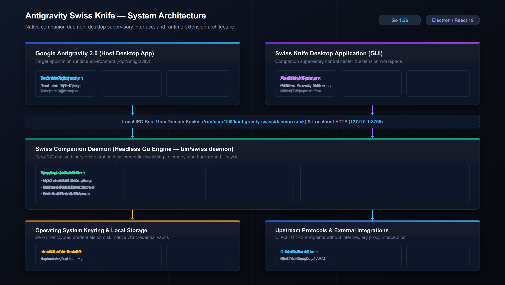
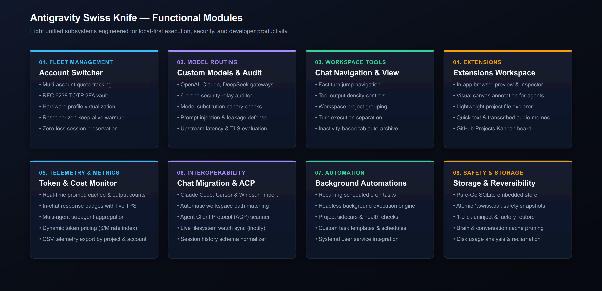
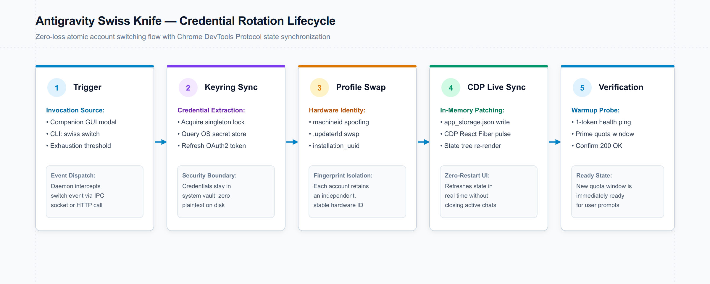

<p align="center">
  
</p>

<h1 align="center">Antigravity Swiss Knife</h1>

<p align="center">
  An open-source desktop companion and local companion daemon for Google Antigravity 2.0.
</p>

<p align="center">
  <a href="#overview">Overview</a> •
  <a href="#key-features">Key Features</a> •
  <a href="#architecture">Architecture</a> •
  <a href="#modules">Modules</a> •
  <a href="#lifecycle">Lifecycle</a> •
  <a href="#platform-support">Platform Support</a> •
  <a href="#installation">Installation</a> •
  <a href="#terms-of-service-alignment--safety-notice">ToS &amp; Safety</a> •
  <a href="#feedback--community">Feedback</a> •
  <a href="#thanks">Thanks</a> •
  <a href="#license">License</a>
</p>

---

## Overview

Antigravity Swiss Knife is a local engineering tool designed to enhance workflows in Google Antigravity 2.0. It provides multi-account quota monitoring, zero-loss credential rotation, custom model security auditing, in-chat token telemetry, and auxiliary development extensions.

> [!NOTE]
> **Active Development & Rapid Iteration**: Antigravity Swiss Knife is actively expanding with frequent releases. We iterate rapidly based on developer workflows—please feel free to report bugs, suggest new capabilities, or share feedback on [GitHub Issues](https://github.com/ChillingWombat/AntigravitySwissKnife/issues).

The project is built on three core technical principles:

- **Local-First Execution**: The daemon and supervisory GUI run entirely on the host system. No network proxies or intermediary servers are inserted between Antigravity and upstream endpoints.
- **Native Keyring Security**: Credentials remain managed inside the operating system's native secret storage (Linux Secret Service API via `libsecret`, macOS Keychain, and Windows Credential Manager).
- **Atomic Reversibility**: Runtime modifications generate pristine `.swiss.bak` snapshots, enabling clean one-click restoration to default system states.

---

## Key Features

<p align="center">
  
</p>

Antigravity Swiss Knife unifies seven developer workflows into a single host companion:

- **Account Switcher**: Real-time CloudCode quota tracking, zero-loss credential rotation, hardware profile isolation (`machineid`, `.updaterId`, `installation_uuid`), and RFC 6238 TOTP vault.
- **Custom Model**: Direct routing for OpenAI, Claude, and DeepSeek with a 6-probe security auditor covering TLS ciphers, canary downgrade detection, and prompt defense.
- **UI Enhancement**: Injected chat controls for prompt turn jumping, collapsible tool cards, live tokens-per-second calculation, and per-turn accounting.
- **Preview Browser**: Docked multi-port web previewer with responsive viewport presets and Chrome DevTools integration for local dev servers.
- **File Explorer**: Integrated filesystem browser with recursive path search, syntax-highlighted previews, and quick scratchpad editing.
- **GitHub Workspace**: Kanban issue tracking (Backlog, In Progress, In Review, Done) linked directly to subagent conversation threads.
- **Quick Memo**: Instant Markdown scratchpad with built-in audio recording, speech-to-text transcription, and tag-based search.

---

## Architecture

The system operates across three decoupled tiers running exclusively on the host: an injected runtime layer inside Antigravity 2.0, a React 19 supervisory desktop interface, and a headless pure-Go daemon (`bin/swiss daemon`) communicating over local Unix domain sockets and loopback HTTP.

<p align="center">
  
</p>

All inter-process communications remain local to the machine, coordinating configuration updates via Chrome DevTools Protocol (CDP) and delegating secret management to operating system keyrings.

---

## Modules

The application is structured into eight functional subsystems:

<p align="center">
  
</p>

Each subsystem operates as an independent module coordinated through the Go companion daemon and exposed via the supervisory GUI and CLI interfaces. Subsystems share state through the local SQLite store and communicate over the Unix domain socket interface.

---

## Lifecycle

Credential rotation and quota synchronizations execute without interrupting active coding sessions or restarting the Antigravity process:

<p align="center">
  
</p>

The companion daemon acquires a process lock, retrieves the target credentials from the OS keyring, swaps hardware profile fingerprints (`machineid`, `.updaterId`, `installation_uuid`), and hot-reloads the Antigravity interface via Chrome DevTools Protocol (CDP). A 1-token probe verifies upstream quota readiness before returning control to the user.


---

## Platform Support

Antigravity Swiss Knife is engineered for cross-platform operation across Linux, Windows, and macOS, directly integrating with each platform's native secret storage service:

| Platform | Keyring Backend | Support Status |
| :--- | :--- | :--- |
| **Linux** | Secret Service API (`libsecret` / `secret-tool`) | Primary development & validation environment |
| **macOS** | Apple Keychain (`security`) | Active testing and verification in progress |
| **Windows** | Windows Credential Manager (`wincred`) | Active testing and verification in progress |

> [!NOTE]
> The companion daemon and supervisory desktop application were developed and verified primarily on Linux. While the architecture and system integrations are cross-platform by design, comprehensive testing and verification for Windows and macOS are currently in progress. Issue reports and operational feedback on these platforms are welcome.

---

## Installation

### Prerequisites

- Go 1.22 or newer
- Node.js 20 or newer with npm
- Native OS secret store (`libsecret` on Linux, Keychain on macOS, Credential Manager on Windows)

### Building from Source

```bash
# 1. Clone the repository
git clone https://github.com/ChillingWombat/AntigravitySwissKnife.git
cd AntigravitySwissKnife

# 2. Build the frontend web bundle
npm run build:frontend

# 3. Build the Go companion binary
npm run build:go

# 4. Verify tests
npm test

# 5. Launch the desktop application
npm run desktop
```

For headless daemon execution only:

```bash
./bin/swiss daemon --web --addr 127.0.0.1:8765
```

---

## Terms of Service Alignment & Safety Notice

### Local Client Compliance

Antigravity Swiss Knife is engineered to align strictly with the **Google Terms of Service** and Google Cloud Acceptable Use policies:

- **Zero Reverse-Engineering of Proprietary Weights**: The tool does not extract model weights, tamper with server-side safety guardrails, or bypass Google account authentication protocols.
- **Native Credential Management**: Operating system credentials are read and switched solely within the user's local operating system keyrings (`secret-tool`, macOS Keychain, Windows Credential Manager).
- **Client Productivity Alignment**: As emphasized by Google engineering guidance:
  > *"Developer productivity utilities that manage authorized local environment state, schedule local developer tasks, or automate client-side window workflows on behalf of an authenticated user remain standard local developer practices, provided they operate directly on the client and do not redistribute, resell, or proxy model access across unauthorized networks."*

### No Proxy Architecture

Antigravity Swiss Knife **does not include or operate an API proxy**. It does not listen on public networks, create remote tunnel endpoints, or translate private Google Antigravity protocols into external REST/OpenAI endpoints. All communications remain on loopback (`127.0.0.1` and Unix domain sockets) strictly between the companion daemon and the host Antigravity desktop application.

### Third-Party Proxies & Critical Account Suspension Warning

If your workflow requires exposing Antigravity as an external OpenAI-compatible HTTP endpoint for third-party tools, independent community projects such as **CLIProxyAPI** exist and can technically be operated in conjunction with this companion.

However, users must be fully aware of the serious account risks involved with proxy solutions:

> [!WARNING]
> **Severe Account Suspension Risk with External Proxies**  
> Routing your Antigravity subscription quotas through an external HTTP proxy—particularly to power automated high-throughput workloads (such as image generation pipelines, multi-user shared pools, or automated web scraping)—violates the Google Terms of Service and will trigger automated abuse detection filters.
> 
> **One-Time Appeal Policy**:  
> Google accounts flagged for subscription abuse or automated proxy tunneling typically have **only one single appeal opportunity**. If the appeal is rejected, the associated Google account and Cloud workspaces will be **permanently and irreversibly banned**.
> 
> We strongly advise users to keep all Antigravity Swiss Knife operations strictly local, interactive, and personal.

---

## Feedback & Community

Antigravity Swiss Knife is under rapid, continuous development. We frequently release updates, improve reliability, and add new capabilities to support evolving developer workflows.

We welcome all community feedback:
- **Bug Reports**: If you experience an unexpected behavior, keyring issue, or platform regression, please open an issue on [GitHub Issues](https://github.com/ChillingWombat/AntigravitySwissKnife/issues).
- **Feature Suggestions**: Have ideas for new workspace modules, integrations, or usability refinements? We actively prioritize community requests.
- **Workflow Discussions**: Join the conversation to share how you use Antigravity Swiss Knife and suggest where friction can be eliminated.

---

## Thanks

Antigravity Swiss Knife builds upon ideas, research, and open-source foundations from the broader developer community. We would like to express our gratitude to the following projects:

- **[api-relay-audit](https://github.com/example/api-relay-audit)**: The six-probe security audit methodology (TLS inspection, canary downgrade detection, and prompt tampering probes) was adapted directly from their security audit architecture.
- **[dsh-chat-import](https://github.com/example/dsh-chat-import)**: The multi-format chat ingestion pipeline and project reconstruction logic were based on their cross-agent conversation parser.
- **[LiteLLM](https://github.com/BerriAI/litellm)** and **[OpenRouter](https://openrouter.ai/)**: The dynamic token pricing model and multi-provider catalog normalizations utilize rate indexing concepts pioneered by LiteLLM and OpenRouter.
- **[modernc.org/sqlite](https://gitlab.com/cznic/sqlite)**: A pure-Go SQLite implementation that enables reliable, embedded persistence across Linux, macOS, and Windows without requiring CGo or external C compilers.
- **[Lucide Icons](https://lucide.dev/)**: The iconography system utilized throughout the companion desktop application.
- **Google CloudCode & Google Antigravity**: The upstream platforms that this companion was developed to support and complement.

---

## License

This project is licensed under the [MIT License](LICENSE).

Antigravity Swiss Knife is an independent community project. It is not affiliated with, sponsored by, or endorsed by Google LLC. All trademarks and registered trademarks belong to their respective owners.
